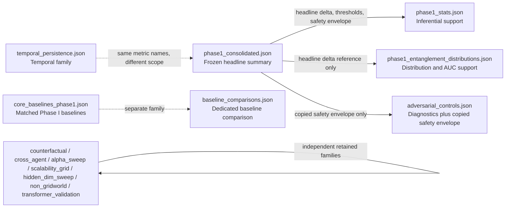

# Retained Artifact Manifest

This manifest describes the live retained artifact layer under `results/`. It is the front-door guide for deciding which file to trust for each result family.

`results/manifest.json` remains the experiment index. `results/ARTIFACT_AUTHORITY_MAP.json` is the machine-readable source of truth for overlap resolution and partial canonicality. `results/ARTIFACT_NOTES.md` records caveats and unresolved ambiguities.

## Live Retained Files

| File | Role | Overlap Group | Canonical For | Not Canonical For | Provenance Note |
|------|------|---------------|---------------|-------------------|-----------------|
| `phase1_consolidated.json` | Frozen class-level Phase I summary | `phase1_core`, `phase1_thresholds`, `phase1_safety` | Headline Phase I delta, thresholds, class-level gate summary, safety envelope | Per-trajectory arrays, inferential p-value, derived AUC support | Only the stale sufficient-data detail string was repaired during normalization. |
| `phase1_stats.json` | Inferential rerun | `phase1_core`, `phase1_inference` | Permutation test, bootstrap CI, per-trajectory entanglement arrays from the per-trajectory-QBM rerun | Headline Phase I delta, frozen class means, frozen thresholds | `delta_observed` remains noncanonical for the headline delta. |
| `phase1_entanglement_distributions.json` | Shared-QBM distribution support artifact | `phase1_core`, `phase1_distribution_support` | Per-trajectory `s_ent` and `pri` arrays in the shared-QBM rerun, derived descriptive AUC support | Headline Phase I delta, frozen class means, frozen thresholds | `delta_validated` reflects the notebook tolerance check rather than exact delta equality. |
| `adversarial_controls.json` | Mixed-provenance adversarial diagnostic artifact | `phase1_safety`, `adversarial_controls` | Mimicry FPR sweep, high-entropy FPR, gamma sweep | Safety-envelope source of truth, headline Phase I delta | Safety-envelope fields are copied from `phase1_consolidated.json`; diagnostics are local to this file. |
| `temporal_persistence.json` | Temporal diagnostic artifact | `temporal_persistence`, `phase1_metric_name_overlap` | Window-size EPS sweep, default-config EPS summaries, default-config PRI summaries | Frozen Phase I class-level EPS or PRI means | Uses `configs/default.yaml`, so same-name overlaps with the frozen summary are not directly comparable. |
| `counterfactual.json` | Counterfactual diagnostic artifact | `counterfactual` | Counterfactual divergence and anticipatory restructuring diagnostics | Frozen gating thresholds | Diagnostic-only in the current release. |
| `cross_agent.json` | Cross-agent inference artifact | `cross_agent` | CLMP summaries, ECI correlation, pair-level inference records | Frozen gating thresholds | Sole retained source for the cross-agent family. |
| `core_baselines_phase1.json` | Matched Phase I RBM/Autoencoder rerun | `baseline_overlap`, `matched_phase1_baselines` | Matched Phase I RBM and Autoencoder accuracy, AUC, FPR, thresholds, deltas | Dedicated five-model baseline-comparison family | Notebook 18 hardcodes latent dimension 16 for the classical models. |
| `baseline_comparisons.json` | Dedicated five-model baseline comparison | `baseline_overlap`, `dedicated_baseline_comparison` | Five-model QBM vs classical baseline comparison family | Matched Phase I RBM and Autoencoder metrics | Normalization repaired only the absolute config path and documented the scope split from `core_baselines_phase1.json`. |
| `hidden_dim_sweep.json` | Exploratory scalability artifact | `hidden_dim_sweep`, `scalability` | Hidden-dimension sweep and mean-field collapse boundary | Frozen Phase I core metrics | Normalization repaired only the absolute config path. |
| `scalability_grid.json` | Exploratory scalability artifact | `scalability` | Grid-size and non-Markovian sweeps | Frozen Phase I core metrics | Sole retained source for this sweep family. |
| `alpha_sweep.json` | Continuation-weight sweep artifact | `alpha_sweep` | Alpha-sweep correlation, monotonicity record, point results | Frozen Phase I core metrics | Sole retained source for this sweep family. |
| `non_gridworld.json` | Generalization-boundary artifact | `non_gridworld` | Non-gridworld transfer-failure result | Frozen Phase I core metrics | Normalization repaired only the absolute config path. |
| `transformer_validation.json` | Exploratory validation artifact | `transformer_validation` | Minimal bounded transformer validation | Frozen Phase I core metrics | Exploratory by design and outside the frozen Phase I authority layer. |

## Authority Graph

The diagram below duplicates the authority relationships already spelled out in the table above.

## Live Surface Versus Historical Provenance

Historical reports in `docs/` and backup snapshots under `.repo_cleanup_backup/` may still refer to retired artifacts such as `confound_ablations_n30.json` and `federated.json`. Those references are preserved for provenance, but they are not part of the live retained authority surface described here.
